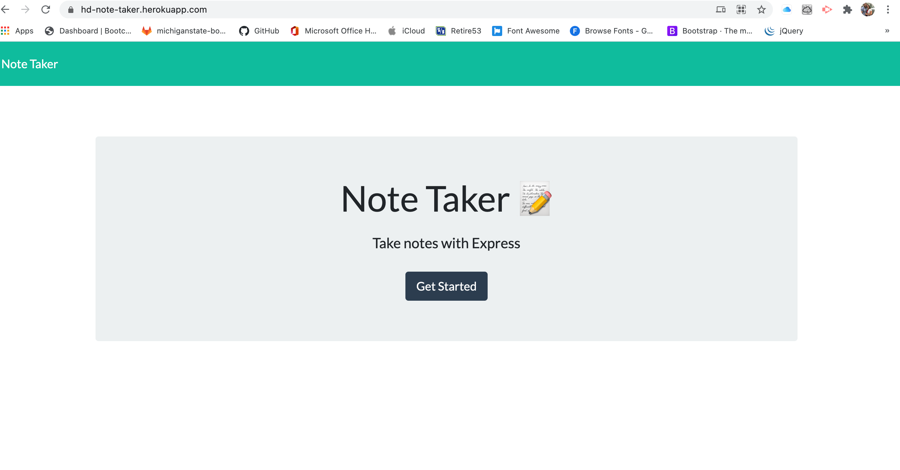
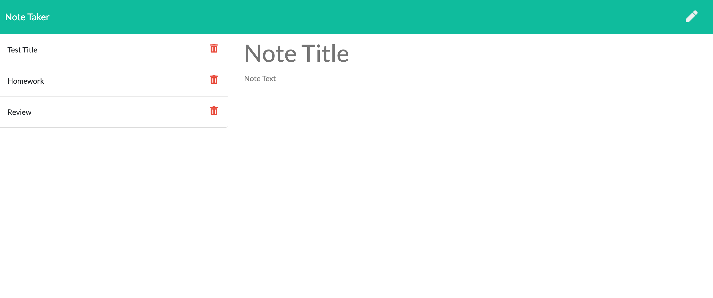

# NOTE TAKER
# Table of Contents

-[Description](#description)
-[Installation](#instructions)
-[Usage](#usage)
-[Contribution](#contribution)
-[Test](#test)
-[Questions](#questions)

## Description:

An application that is deployed on heroku. This application will allow you to save your notes across multiple devices and delete notes when they are no longer needed.
## Installation:
Must install npm, inquirer, fs, util. 
## Usage:
To be used as a tool to maintain notes in an organized application
## Contribution:
Submit contribution to git hub to be reviewed
## Test:
none

* Click on the link below to view the live app.
-[Link to the live app](https://hd-note-taker.herokuapp.com/)

* Below is a screen shot of the app.

* Below is a screen shot of the app.

* Below is a link to the repository 
-[Link  to the github repo] (https://github.com/HectorDiazJr/Note-Taker)

## Questions:
Click on the link belwo to go to my GitHub page, for additional questions:

-[GitHub Profile](https://github.com/hectordiazjr)

Email me at hectordiaz1103@gmail.com with further questions.
    